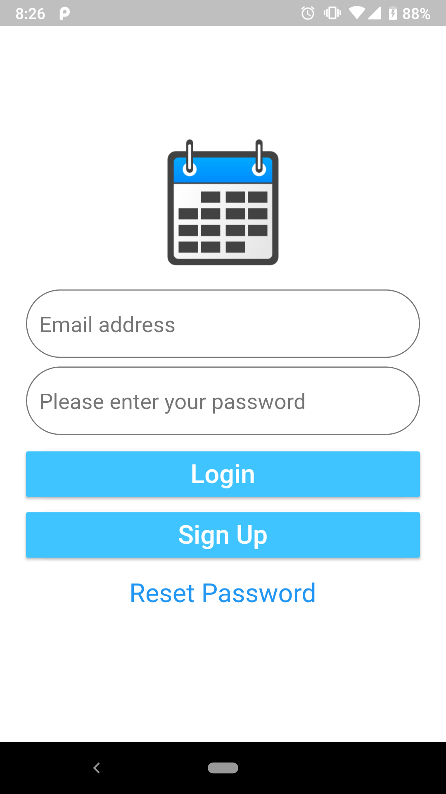
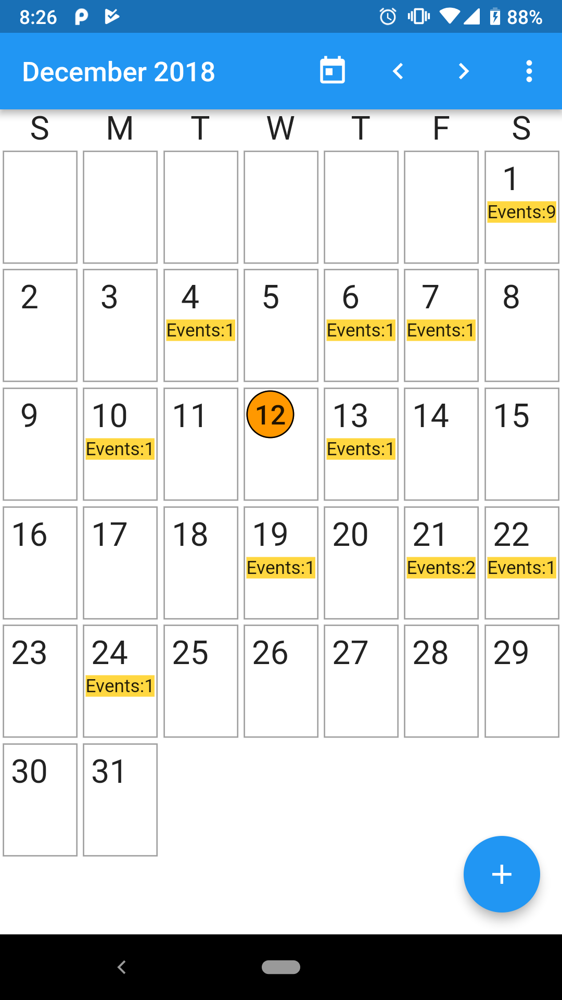

# Flutter Application
A new Flutter application implementing a simple mobile calendar app for storing basic events into Firebase cloud database.

## Google Play Store Link: 
https://play.google.com/store/apps/details?id=com.graham.calendar

## Tools:
cron-job link: https://cron-job.org

## Diagram of basic architecture


## Firebase Cloud Firestore Database Tree
```
calendar_events (collection)
	|
	 - email (field as string)
	 - name (field as string)
	 - summary (field as string)
	 - time (field as timestamp)

users (collection)
	|
	|- contacts (collection)
	|	|
	|	|- contact_gifts (collection)
	|	| 	|
	|	| 	|- cost (field as number)
	|	| 	|- name (field as string)
 	|	|- name(field as string)
        |
 	|- email (field as string)
 	|- token (field as string)
```

## Screen Shots:





